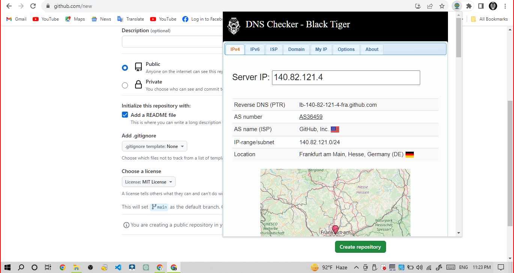
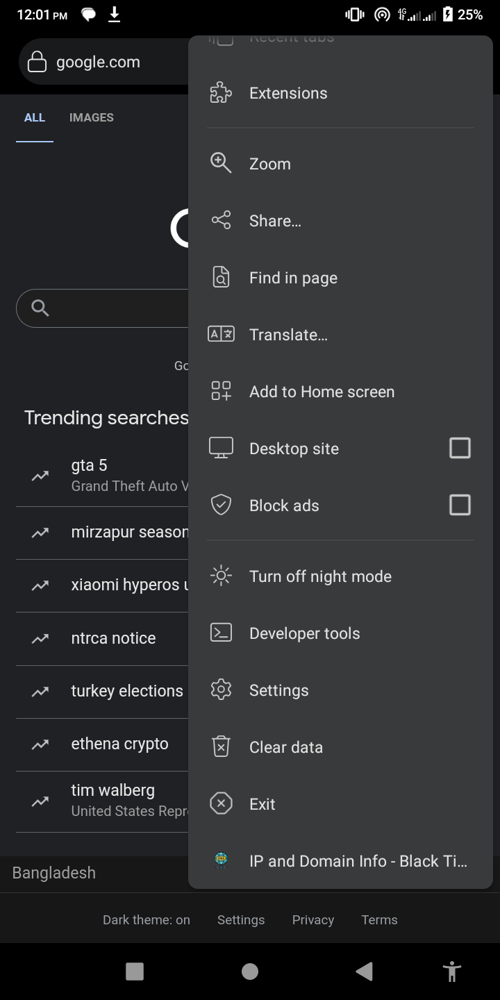
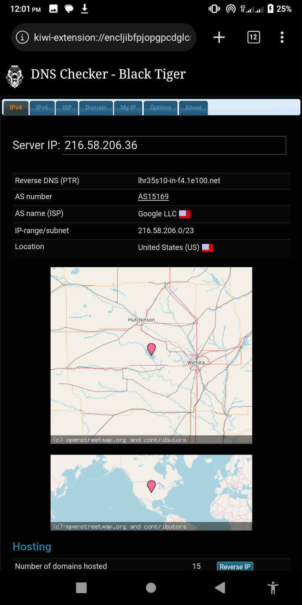
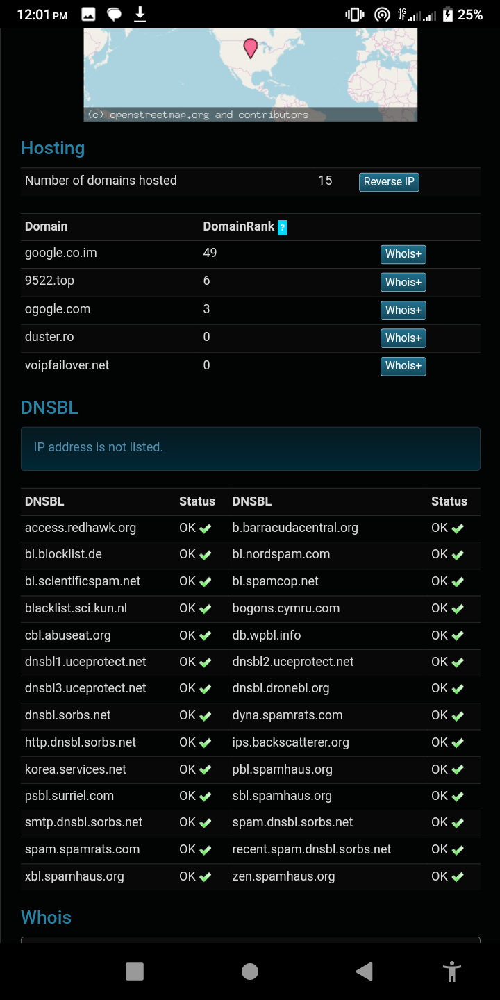
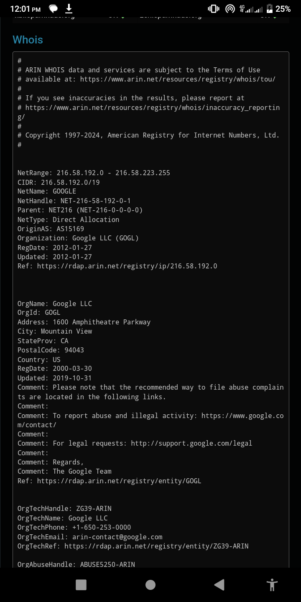
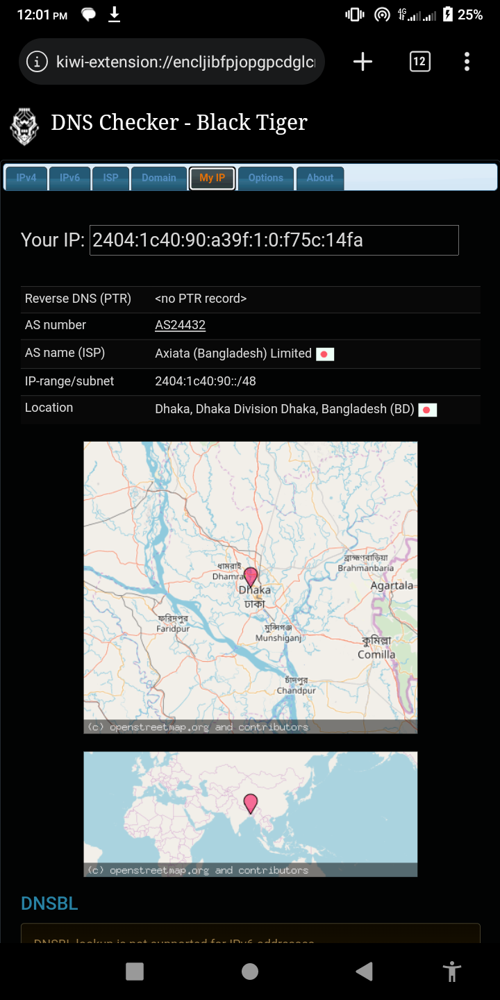
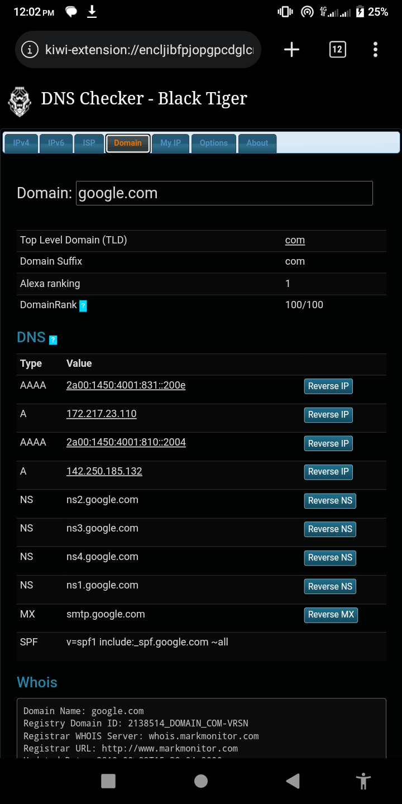
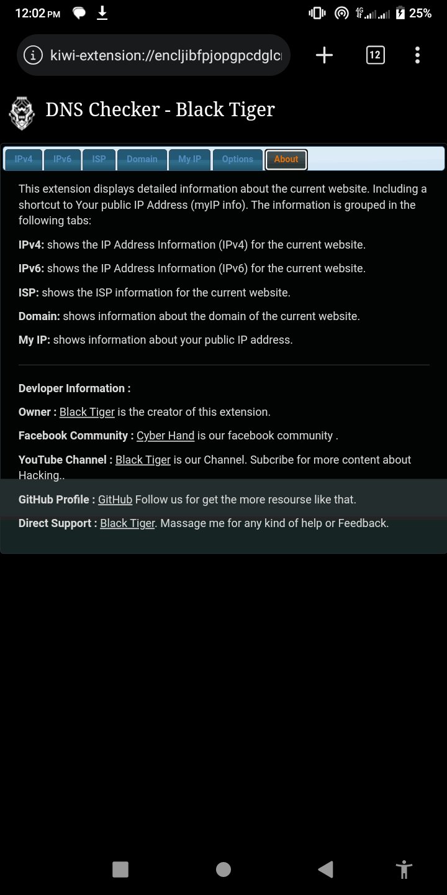

# 🕵️‍♂️ Website Information Chrome Extension 🕵️‍♀️

## Overview

🔍 This Chrome extension provides detailed information about the current website, including IPv4, IPv6, ISP, domain details, and your public IP address.

## Features

### IPv4
🖥️ Displays detailed information about the IPv4 address associated with the current website. This includes:
- IP address
- Location (country, region, city)
- Autonomous System Number (ASN)
- Internet Service Provider (ISP)

### IPv6
🔗 Provides comprehensive information about the IPv6 address of the current website. This includes:
- IP address
- Location (country, region, city)
- Autonomous System Number (ASN)
- Internet Service Provider (ISP)

### ISP
🌐 Shows detailed information about the Internet Service Provider (ISP) of the current website. This includes:
- ISP name
- ASN (Autonomous System Number)
- Organization
- IP range

### Domain
🔑 Offers insights into the domain of the current website. This includes:
- Domain name
- Registrar
- Registration date
- Expiry date
- Name servers

### My IP
🌐 Displays information about your public IP address. This includes:
- IP address
- Location (country, region, city)
- Autonomous System Number (ASN)
- Internet Service Provider (ISP)

## Developer Information

- **Owner**: Black Tiger
- **Facebook Community**: [Cyber Hand](https://www.facebook.com/cyberhand)
- **YouTube Channel**: [Black Tiger](https://www.youtube.com/blacktiger)
  - Subscribe for more content about Hacking.
- **GitHub Profile**: [Black Tiger on GitHub](https://github.com/blacktiger)
  - Follow us for more resources like this.
- **Direct Support**: Black Tiger
  - Feel free to message me for any kind of help or feedback.

## Screenshots

## Download

[<button style="background-color:#4CAF50;border:none;color:white;padding:15px 32px;text-align:center;text-decoration:none;display:inline-block;font-size:16px;margin:4px 2px;cursor:pointer;">📥 Download the extension (.zip) 📥</button>](https://github.com/rabinasiyam/IP-Info-Extension/raw/main/extension.zip)
